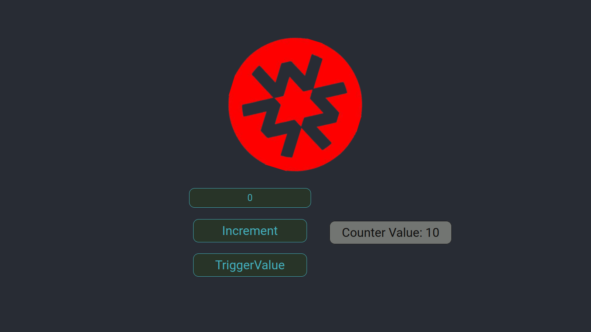

# Massa-test

This is a monorepo for a simple dApp, which is an implementation of a counter using the Massa environment.

  

## Table of Contents

- [Massa-test](#massa-test)
  - [Table of Contents](#table-of-contents)
  - [Getting started](#getting-started)
    - [Backend](#backend)
    - [Frontend](#frontend)
  - [Usage](#usage)
  - [Stack used](#stack-used)
  - [License](#license)

## Getting started

### Backend

To set up the backend, please do the following steps:

- Go to the `backend` folder: `cd backend`
- Install dependencies: `npm install`
- Compile the smart contract: `npm run build`
- Deploy the smart contract: `npm run deploy`

### Frontend

To set up the frontend, please do the following steps:

- Go to the `frontend` folder: `cd frontend`
- Install dependencies: `npm install`
- Start the frontend: `npm start`

## Usage

Once you have set up the backend and frontend, you can use the dApp to increment and trigger the value of the counter stored on-chain.

1. Open the frontend by navigating to http://localhost:3000/ in your web browser.
2. In the frontend, you will see the current value of the counter displayed after calling the `TriggerValue` function of the smart contract
3. To increment the counter, enter an unsigned integer into the input field and click the `Increment` button. The counter will be incremented by the specified value and the new value will be displayed.
4. To trigger the current value of the counter, click the `TriggerValue` button. The current value of the counter will be displayed in the console.

## Stack used

[massa-web3](https://github.com/massalabs/massa-web3) is a TypeScript library that allow you to interact with the Massa blockchain through a local or remote Massa node.

[create-react-app-massa](https://github.com/massalabs/create-react-app-massa) is a minimal React template made for our massa-web3 library.

[massa-sc-examples](https://github.com/massalabs/massa-sc-examples) is a collection of smart contracts examples.

[massa-sc-toolkit](https://github.com/massalabs/massa-sc-toolkit/) is a toolkit meant to facilitate smart contract development, testing and deployment.

[massa-sc-tester](https://github.com/massalabs/massa-sc-tester) is a minimal testing environment made for running massa smart contracts locally.

[massa-sc-project-initializer](https://docs.massa.net/en/latest/web3-dev/smart-contracts/getting-started.html#sc-getting-started)is a tool that creates a boilerplate smart-contract project. To create a smart-contract project, invoke the initializer by running:

`npx clear-npx-cache && npx @massalabs/sc-project-initializer@dev init my-sc && cd my-sc`

Please refer to the documentation for more information here https://docs.massa.net/

## License

This project is licensed under the [Unlicense](http://unlicense.org/) or the [Creative Commons CC0 1.0 Universal](https://creativecommons.org/publicdomain/zero/1.0/) license. This means that anyone can use this code for any purpose without any restrictions.

  

